# Design Document: AI Content Generation

## Overview

O AI_Content_Generation_Module é uma camada **acima** dos módulos existentes de mensageria e de publicação: consome (somente-leitura) o catálogo de Services do Workspace, orquestra geração de imagem + texto e entrega Post_Drafts ao Social_Publishing_Module já em produção. O módulo é estruturalmente isolado (tabelas próprias, bucket próprio, entrada de navegação própria, permissões próprias), e nunca escreve em tabelas de outros módulos — a única saída é uma chamada de server function pública do Social_Publishing_Module.

### Decisões-chave

**1. Renderização server-side com Satori + resvg (Vercel OG stack).**

Foram avaliadas três abordagens de composição de imagem:

| Abordagem | Vantagens | Desvantagens |
|---|---|---|
| **A. Puppeteer/Playwright** | HTML/CSS completo | Chromium pesado (~200 MB), lento em cold start, difícil em Vercel serverless |
| **B. node-canvas / @napi-rs/canvas** | Rápido | API imperativa; layout de texto complexo (line breaks, word wrap com fontes custom) exige código manual |
| **C. Satori + @resvg/resvg-js** (escolhida) | JSX declarativo (React-like), rápido, funciona em Vercel/Node, layout de texto correto out-of-the-box, mesmo stack do Vercel OG Images | Subconjunto de CSS suportado (flex sim, grid não); fontes precisam ser carregadas como ArrayBuffer |

Satori converte JSX + fontes + CSS-subset em SVG. `@resvg/resvg-js` converte SVG em PNG. Ambos são zero-dependência-nativa e funcionam em serverless. Requirement 10.3 (mesmos inputs → mesmos bytes) é atendido porque Satori é determinístico dado o mesmo conjunto de fontes.

**2. Fontes armazenadas como assets do projeto (não CDN em runtime).**

Fontes do Google Fonts são carregadas uma vez, no build/deploy, como arquivos `.ttf`/`.woff` sob `src/features/content-generation/assets/fonts/`. Isso evita: (a) dependência de rede a cada render; (b) inconsistência entre workspaces (versão do arquivo pode mudar no CDN); (c) risco de bloqueio do Google Fonts em regiões da Vercel. Um único carregamento por processo, cacheado em memória, atende todos os workspaces.

**3. Image Bank abstraído com falha em cascata explícita.**

`image-bank.server.ts` expõe `searchImage(query, opts)` que tenta Pexels → Unsplash → Pixabay em ordem, com timeout curto por provedor (3s). Cada provedor tem seu próprio adaptador. A chamada bem-sucedida é registrada em `content_jobs.image_provider_used` para observabilidade (Req 16). O Workspace_Member nunca vê o nome do provedor — a UI apenas mostra "imagem gerada pelo sistema".

**4. Nano Banana só via opt-in ou fallback duro.**

O AI_Image_Provider é abstraído em `ai-image.server.ts` com uma única função `generateImage(prompt, aspectRatio)`. Só é chamada quando (a) `image-bank.server.ts` retornou `null` para todos os provedores, ou (b) o Content_Brief tem `ai_image_optin=true`. Antes de qualquer chamada, `plan-quota-hook.server.ts` é consultado (Req 15.5) — nesta fase sempre devolve permitido, mas o call site já está pronto.

**5. Content_Job assíncrono via job-worker existente (isolado por tipo).**

Um Content_Job novo insere uma linha em `message_jobs` (tabela já usada por scheduled sends e outros) com `job_type='content_generation'`. O worker existente em `src/lib/job-worker.ts` roteia pelo tipo — vamos adicionar um handler dedicado `content-generation-worker.server.ts`. Alternativa considerada: criar uma tabela `content_jobs_queue` própria. Rejeitada porque `message_jobs` já tem o mecanismo de retry, lease, e o worker já roda no Railway; reaproveitar reduz uma peça de infraestrutura sem violar o isolamento (a tabela `message_jobs` é infraestrutura transversal, não módulo de negócio, e o payload é opaco a ela). **Todos os dados de negócio ficam em tabelas próprias** (`content_briefs`, `content_jobs`, `generated_assets`).

**6. Gemini reusa cliente existente com prompt dedicado.**

`src/lib/ai-respond.server.ts` já usa `@google/generative-ai` em outros lugares. Vamos adicionar um cliente novo `ai-text.server.ts` na feature de conteúdo, com prompts próprios (viral structure, JSON schema forçado via `responseSchema` do Gemini). Não reusamos o prompt de atendimento — são domínios diferentes; reusamos apenas o SDK e a env var.

**7. Handoff pro Social_Publishing_Module via server function pública.**

Ao aprovar um Generated_Asset, chamamos `submitSocialPost` (server function pública do Social_Publishing_Module) passando: rendered image (URL do bucket), copy per network, targets, post_type per network, scheduled_time opcional. O módulo de publicação faz o resto (upload, chamada Zernio, webhook, retry). A partir daí, o AI_Content_Generation_Module apenas mostra o `social_post_id` retornado no histórico do asset — status detalhado é responsabilidade do módulo de publicação.

## Architecture

```mermaid
graph TB
    subgraph Client["Browser (React)"]
        UIB[Brand Kit<br/>editor]
        UIT[Templates<br/>galeria]
        UIC[Compose<br/>brief + preview]
        UIA[Assets<br/>aprovação]
    end

    subgraph Server["TanStack Start Server Functions"]
        BF[brand-kit.functions.ts]
        CF[content-generation.functions.ts]
        TF[templates.functions.ts]
    end

    subgraph Workers["Server-only worker"]
        JW[job-worker.ts existente]
        CGW[content-generation-worker.server.ts<br/>novo handler]
    end

    subgraph Libs["Server-only libs"]
        RE[render-engine.server.ts<br/>Satori + resvg]
        IB[image-bank.server.ts<br/>Pexels → Unsplash → Pixabay]
        AII[ai-image.server.ts<br/>Nano Banana]
        AIT[ai-text.server.ts<br/>Gemini Flash]
        BX[brand-extractor.server.ts<br/>cheerio + node-vibrant]
        PQ[plan-quota-hook.server.ts]
    end

    subgraph DB["Supabase Postgres (novas tabelas)"]
        BK[brand_kits]
        CB[content_briefs]
        CJ[content_jobs]
        GA[generated_assets]
        CUM[content_usage_meters]
        CPP[content_publishing_permissions]
        MJ[(message_jobs<br/>job_type='content_generation')]
    end

    subgraph ReadOnly["Read-only cross-module"]
        SVC[services / service_photos]
        SPM[social_account_connections<br/>via server fn pública]
    end

    subgraph Storage["Supabase Storage"]
        BUCKET[bucket: ai-content]
    end

    subgraph External["APIs externas"]
        EXT1[Pexels API]
        EXT2[Unsplash API]
        EXT3[Pixabay API]
        EXT4[Google Gemini Flash]
        EXT5[Google Nano Banana]
    end

    subgraph Handoff["Handoff"]
        SPUB[submitSocialPost<br/>server fn do Social_Publishing_Module]
    end

    UIB --> BF
    UIT --> TF
    UIC --> CF
    UIA --> CF
    BF --> BX
    BF <--> BK
    CF --> PQ
    CF --> CB
    CF -->|enqueue| MJ
    JW --> CGW
    CGW --> RE
    CGW --> IB
    CGW --> AII
    CGW --> AIT
    CGW <--> CJ
    CGW <--> GA
    CGW <--> CUM
    CGW -.read.-> SVC
    CGW --> BUCKET
    IB --> EXT1
    IB --> EXT2
    IB --> EXT3
    AIT --> EXT4
    AII --> EXT5
    UIA -->|approve| CF
    CF --> SPUB

    style DB fill:#1a3a1a
    style Libs fill:#1a1a3a
    style ReadOnly fill:#3a2a1a
```



## Data Models

### Tabelas novas

```sql
-- brand_kits: 1 por workspace, editável pelo Manager
create table brand_kits (
  id uuid primary key default gen_random_uuid(),
  owner_user_id uuid not null references auth.users(id) on delete cascade,
  primary_color text not null default '#0EA5E9',
  secondary_color text not null default '#1E293B',
  support_color text not null default '#F59E0B',
  logo_url text,
  display_font text not null default 'Playfair Display',
  body_font text not null default 'Inter',
  tone_of_voice text not null default 'profissional',
  default_signature text default '',
  extraction_source text, -- 'instagram_handle' | 'website_url' | 'manual'
  extraction_metadata jsonb, -- {handle, url, extracted_at, confidence}
  created_at timestamptz not null default now(),
  updated_at timestamptz not null default now(),
  unique(owner_user_id)
);

-- content_briefs: entrada do usuário; sobrevive ao content_job
create table content_briefs (
  id uuid primary key default gen_random_uuid(),
  owner_user_id uuid not null references auth.users(id) on delete cascade,
  created_by uuid not null references auth.users(id),
  template_category text not null, -- 'promo' | 'novidade' | 'depoimento' | ...
  post_format text not null, -- 'single' | 'carousel' | 'story'
  carousel_slide_count int, -- 2..10, obrigatório se post_format='carousel'
  target_networks text[] not null, -- ['facebook','instagram','tiktok','youtube']
  service_id uuid, -- FK lógico pro services (sem constraint pra manter isolamento; validação em app)
  free_text_objective text,
  tone_override text,
  ai_image_optin boolean not null default false,
  created_at timestamptz not null default now()
);

-- content_jobs: execução; 1 job por brief (ou N se regeneração)
create table content_jobs (
  id uuid primary key default gen_random_uuid(),
  owner_user_id uuid not null references auth.users(id) on delete cascade,
  brief_id uuid not null references content_briefs(id) on delete cascade,
  status text not null default 'pending', -- pending|running|completed|failed
  stage text, -- 'image_bank'|'ai_image'|'ai_text'|'render' quando running/failed
  error_message text,
  image_provider_used text, -- 'pexels'|'unsplash'|'pixabay'|'nano_banana'|'service_photo'
  ai_text_model text, -- 'gemini-flash-latest'
  cost_estimate_cents int not null default 0,
  duration_ms int,
  started_at timestamptz,
  completed_at timestamptz,
  created_at timestamptz not null default now()
);

-- generated_assets: um por network alvo (ou 1 pra carrossel multi-slide)
create table generated_assets (
  id uuid primary key default gen_random_uuid(),
  owner_user_id uuid not null references auth.users(id) on delete cascade,
  job_id uuid not null references content_jobs(id) on delete cascade,
  target_network text not null, -- 'facebook'|'instagram'|'tiktok'|'youtube'
  version int not null default 1, -- incrementa em regeneração
  parent_asset_id uuid references generated_assets(id), -- versão anterior
  approval_status text not null default 'pending', -- 'pending'|'approved'|'rejected'
  rendered_image_url text not null, -- URL pública do bucket
  slides_json jsonb, -- pra carrossel: array de {url, index}
  copy_bundle jsonb not null, -- {hook, body, cta, hashtags, short_caption}
  image_source_metadata jsonb, -- {provider, author, attribution_url} — auditoria (Req 4.4)
  ai_image_prompt text, -- persistido pra regenerar (Req 5.5)
  social_post_id uuid, -- retornado pelo Social_Publishing_Module após handoff
  approved_at timestamptz,
  approved_by uuid references auth.users(id),
  rejected_at timestamptz,
  created_at timestamptz not null default now()
);

-- content_usage_meters: contadores por workspace/mês
create table content_usage_meters (
  id uuid primary key default gen_random_uuid(),
  owner_user_id uuid not null references auth.users(id) on delete cascade,
  period_year_month text not null, -- 'YYYY-MM' na tz do workspace
  metric text not null, -- 'posts_generated'|'ai_images_generated'|'content_jobs_started'
  count int not null default 0,
  updated_at timestamptz not null default now(),
  unique(owner_user_id, period_year_month, metric)
);

-- content_publishing_permissions: por workspace_member ou fallback por role
create table content_publishing_permissions (
  id uuid primary key default gen_random_uuid(),
  owner_user_id uuid not null references auth.users(id) on delete cascade,
  workspace_member_id uuid, -- null = default por role
  role text, -- 'manager'|'agent' quando workspace_member_id é null
  can_brand_edit boolean not null default false,
  can_brief_create boolean not null default true,
  can_asset_approve boolean not null default true,
  can_publish_immediate boolean not null default false,
  can_ai_image_optin boolean not null default false,
  updated_at timestamptz not null default now(),
  check ((workspace_member_id is not null) or (role is not null))
);
```

### RLS

Padrão idêntico ao módulo de publicação:

```sql
alter table brand_kits enable row level security;
create policy brand_kits_owner on brand_kits for all
  using (owner_user_id = auth.uid() or owner_user_id = public.get_my_workspace_owner())
  with check (owner_user_id = auth.uid() or owner_user_id = public.get_my_workspace_owner());
-- (repetir para as outras 5 tabelas)
```

### Storage bucket

Bucket privado `ai-content` com pastas por workspace:
```
ai-content/
  {owner_user_id}/
    logos/{brand_kit_id}.{ext}
    renders/{asset_id}/{version}.png
    renders/{asset_id}/{version}-slide-{n}.png
    image-bank-cache/{hash}.{ext}
```

Policies: leitura restrita ao workspace (idêntico ao bucket `social-media`).

## Components and Interfaces

Componentes de servidor (server-only libs) e suas responsabilidades:

- `render-engine.server.ts` — pipeline Satori + resvg; entrada `(templateId, brandKit, slots) → Buffer PNG`.
- `image-bank.server.ts` — abstração de Pexels/Unsplash/Pixabay com falha em cascata; expõe `searchImage(query, opts)`.
- `image-bank/pexels-adapter.ts`, `unsplash-adapter.ts`, `pixabay-adapter.ts` — adaptadores por provedor.
- `ai-image.server.ts` — cliente do Nano Banana; expõe `generateImage(prompt, aspectRatio)`.
- `ai-text.server.ts` — cliente Gemini Flash com prompt viral e schema JSON forçado; expõe `generateCopyBundle(input)`.
- `brand-extractor.server.ts` — expõe `extractFromInstagram(handle)` e `extractFromWebsite(url)`; nunca bloqueia.
- `plan-quota-hook.server.ts` — expõe `checkQuota(workspaceId, metric)`; nesta fase sempre permite.
- `content-generation-worker.server.ts` — handler do job type `content_generation`, orquestra o pipeline.
- `template-registry.ts` — mapa `{ id → { component, category, ratio, slots[], width, height } }`.

Componentes de servidor (server functions expostas ao browser):

- `brand-kit.functions.ts` — CRUD do Brand_Kit + extração por handle/URL.
- `content-generation.functions.ts` — submitBrief, listAssets, approveAsset, rejectAsset, regenerateAsset.
- `templates.functions.ts` — listTemplates por categoria com preview renderizado sob o Brand_Kit atual.
- `content-permissions.functions.ts` — CRUD de content_publishing_permissions.

Componentes de UI (React):

- `BrandKitEditor` — form com upload de logo, seletores de cor, dropdowns de fonte, extração automática.
- `TemplateGallery` — grid de previews clicáveis; reusa `Card` do design system.
- `ComposeWizard` — multi-step: categoria → formato → serviço → texto livre → alvos → gerar.
- `AssetApprovalPanel` — split view (imagem à esquerda, copy editável à direita); ações approve/reject/regenerate.
- `ContentSidebarEntry` — item novo do `app-sidebar.tsx`.

## Renderização (Render Engine)

### Templates como componentes JSX

Cada Design_Template é um módulo TypeScript sob `src/features/content-generation/templates/`:

```
templates/
  promo/
    promo-01-1x1.tsx     // proporção feed 1:1
    promo-01-9x16.tsx    // proporção story/reel 9:16
  novidade/
    ...
  registry.ts            // catálogo com metadata (id, category, ratio, slots)
```

Cada template exporta:

```ts
export type TemplateProps = {
  brandKit: BrandKit;
  slots: {
    headline?: string;
    subheadline?: string;
    imageUrl?: string; // já é dataURL ou URL absoluta
    price?: string;
    ctaLabel?: string;
    duration?: string;
  };
  slideIndex?: number; // pra carrossel: cover=0, content=1..n-2, cta=n-1
  slideTotal?: number;
};

export default function Promo01_1x1({ brandKit, slots }: TemplateProps) {
  return (
    <div style={{
      width: 1080, height: 1080,
      display: 'flex', flexDirection: 'column',
      background: brandKit.primary_color,
      fontFamily: brandKit.body_font,
    }}>
      {/* layout */}
    </div>
  );
}
```

### Pipeline de render

`render-engine.server.ts`:

```ts
async function renderAsset(templateId, brandKit, slots): Promise<Buffer> {
  const Template = templateRegistry.get(templateId);
  const fonts = await loadFonts([brandKit.display_font, brandKit.body_font]);
  const svg = await satori(<Template brandKit={brandKit} slots={slots} />, {
    width: template.width,
    height: template.height,
    fonts,
    embedFont: true,
  });
  const png = new Resvg(svg, { fitTo: { mode: 'width', value: template.width } }).render();
  return png.asPng();
}
```

Fontes carregadas de `src/features/content-generation/assets/fonts/*.ttf`, cacheadas em memória por processo.

### Fontes whitelist (Req 2.5)

`src/features/content-generation/fonts/whitelist.ts`:

```ts
export const DISPLAY_FONTS = ['Playfair Display', 'Bebas Neue', 'Montserrat', 'Poppins', 'Oswald'] as const;
export const BODY_FONTS = ['Inter', 'DM Sans', 'Lato', 'Nunito'] as const;
export const SCRIPT_FONTS = ['Dancing Script', 'Caveat'] as const;
```

## Image Bank

`image-bank.server.ts`:

```ts
export type ImageBankResult = {
  url: string;              // URL pra baixar
  cached_url?: string;      // após cache no bucket
  provider: 'pexels' | 'unsplash' | 'pixabay';
  author: string;
  provider_url: string;
  attribution_url: string;  // URL de atribuição obrigatória
  width: number;
  height: number;
};

export async function searchImage(query: string, opts: {
  aspectRatio?: '1:1' | '9:16' | '16:9';
  minWidth?: number;
  colorHint?: string; // hex
}): Promise<ImageBankResult | null> {
  const providers = [pexelsAdapter, unsplashAdapter, pixabayAdapter];
  for (const p of providers) {
    try {
      const result = await withTimeout(p.search(query, opts), 3000);
      if (result) return result;
    } catch (err) {
      logProviderError(p.name, err);
      continue;
    }
  }
  return null;
}
```

Adapters em `image-bank/pexels-adapter.ts`, `unsplash-adapter.ts`, `pixabay-adapter.ts` — cada um implementa `search(query, opts)`. Env vars: `PEXELS_API_KEY`, `UNSPLASH_ACCESS_KEY`, `PIXABAY_API_KEY`.

### Cache

`cacheImageBankImage(result: ImageBankResult, workspaceId: string): Promise<string>`:
- Hash SHA-256 da URL + provider como filename
- Verifica se `ai-content/{workspaceId}/image-bank-cache/{hash}.jpg` já existe
- Se sim, retorna URL pública direto
- Senão, faz download da URL do provedor e sobe pro bucket

## AI Text (Gemini Flash)

`ai-text.server.ts`:

```ts
export async function generateCopyBundle(input: {
  brief: ContentBrief;
  brandKit: BrandKit;
  service?: Service;
  targetNetworks: SocialPlatform[];
}): Promise<CopyBundle> {
  const prompt = buildViralPrompt(input);
  const response = await geminiFlash.generateContent({
    contents: [{ role: 'user', parts: [{ text: prompt }] }],
    generationConfig: {
      responseMimeType: 'application/json',
      responseSchema: COPY_BUNDLE_SCHEMA,
    },
  });
  const parsed = CopyBundleSchema.parse(JSON.parse(response.text()));
  await moderateCopy(parsed); // Req 6.4
  return parsed;
}
```

`COPY_BUNDLE_SCHEMA` força o Gemini a devolver:
```json
{
  "hook": "string (max 60 chars)",
  "body": "string (max 500 chars)",
  "cliffhanger": "string (max 80 chars)",
  "cta": "string (max 40 chars)",
  "hashtags": ["string (max 8 items)"],
  "short_caption": "string (max 100 chars)",
  "per_network": {
    "facebook": { "full_text": "string" },
    "instagram": { "full_text": "string" },
    "tiktok": { "full_text": "string" },
    "youtube": { "title": "string", "description": "string" }
  }
}
```

Se o Gemini devolver JSON inválido ou fora do schema, `CopyBundleSchema.parse` (Zod) rejeita → job vai pra `failed` no stage `ai_text`.

## AI Image (Nano Banana / fallback)

`ai-image.server.ts`:

```ts
export async function generateImage(input: {
  prompt: string;
  aspectRatio: '1:1' | '9:16' | '16:9';
  brandColorHint?: string;
}): Promise<{ url: string; prompt_used: string }> {
  // Chama API do Nano Banana (endpoint a definir; provavelmente Gemini image gen)
  // Retorna URL do resultado hospedado no nosso bucket
}
```

Endpoint e SDK exatos serão confirmados na task de implementação (task 12); a interface é a acima e o call site já respeita o quota hook.

## Brand Extraction

`brand-extractor.server.ts`:

```ts
export async function extractFromInstagram(handle: string): Promise<Partial<BrandKit>> {
  // 1. Fetch da página pública do IG
  // 2. Parse com regex simples da bio + profile pic URL
  // 3. Download da profile pic → node-vibrant → paleta 3 cores
  // 4. Retorna { primary_color, secondary_color, logo_url } — sem sobrescrever fontes
}

export async function extractFromWebsite(url: string): Promise<Partial<BrandKit>> {
  // 1. Fetch da URL
  // 2. cheerio: pega <meta name="theme-color">, favicon, og:image
  // 3. node-vibrant sobre favicon/og:image → paleta
  // 4. Retorna { primary_color, secondary_color, logo_url }
}
```

Nenhuma extração bloqueia — em caso de falha, campos ficam vazios pra entrada manual (Req 2.4).

## Content_Job pipeline

Worker handler `content-generation-worker.server.ts`:

```ts
async function processContentGenerationJob(payload: { job_id: string }) {
  const job = await loadJob(payload.job_id);
  const brief = await loadBrief(job.brief_id);
  const brandKit = await loadBrandKit(job.owner_user_id);

  try {
    // Stage 1: resolver imagem
    await updateJob(job.id, { status: 'running', stage: 'image_bank', started_at: now() });
    const service = brief.service_id ? await loadService(brief.service_id, job.owner_user_id) : null;
    let imageResult: ImageBankResult | { url: string; provider: 'service_photo' | 'nano_banana' };

    if (service && service.photos.length > 0) {
      imageResult = { url: service.photos[0].url, provider: 'service_photo' };
    } else {
      const query = buildImageQuery(brief, service, brandKit);
      const bankResult = await searchImage(query, {
        aspectRatio: aspectRatioFor(brief.post_format),
        colorHint: brandKit.primary_color,
      });
      if (bankResult) {
        const cachedUrl = await cacheImageBankImage(bankResult, job.owner_user_id);
        imageResult = { ...bankResult, url: cachedUrl };
      } else if (brief.ai_image_optin || FALLBACK_TO_AI_ON_EMPTY) {
        await updateJob(job.id, { stage: 'ai_image' });
        await enforceQuota(job.owner_user_id, 'ai_image');
        const aiImg = await generateImage({ prompt: buildAiImagePrompt(brief), aspectRatio: aspectRatioFor(brief.post_format), brandColorHint: brandKit.primary_color });
        imageResult = { url: aiImg.url, provider: 'nano_banana' };
        await incrementMeter(job.owner_user_id, 'ai_images_generated');
      } else {
        throw new ContentJobError('image_bank', 'Nenhuma imagem encontrada e opt-in de IA desativado');
      }
    }

    // Stage 2: gerar copy
    await updateJob(job.id, { stage: 'ai_text' });
    const copyBundle = await generateCopyBundle({ brief, brandKit, service, targetNetworks: brief.target_networks });

    // Stage 3: render por rede (ou 1 asset multi-slide se carrossel)
    await updateJob(job.id, { stage: 'render' });
    const templateId = pickTemplate(brief.template_category, brief.post_format);
    const assets = brief.post_format === 'carousel'
      ? [await renderCarouselAsset(job, brandKit, imageResult, copyBundle, templateId, brief.carousel_slide_count!)]
      : await Promise.all(brief.target_networks.map(net => renderSingleAsset(job, brandKit, imageResult, copyBundle, templateId, net)));

    // Stage 4: gravar assets
    for (const asset of assets) await insertAsset(asset);
    await updateJob(job.id, { status: 'completed', completed_at: now(), duration_ms: elapsed(job) });
  } catch (err) {
    await updateJob(job.id, { status: 'failed', error_message: err.message, stage: err.stage ?? 'unknown' });
    throw err;
  }
}
```

## Aprovação e handoff

`content-generation.functions.ts`:

```ts
export const approveAsset = createServerFn({ method: 'POST' })
  .middleware([requireSupabaseAuth])
  .inputValidator(z.object({
    assetId: z.string().uuid(),
    scheduledFor: z.string().datetime().optional(),
    accountConnectionIds: z.record(z.enum(['facebook','instagram','tiktok','youtube']), z.string().uuid()),
    postType: z.record(z.enum(['facebook','instagram','tiktok','youtube']), z.string()),
  }).parse)
  .handler(async ({ data, context }) => {
    // 1. Checa permissão can_asset_approve + can_publish_immediate
    // 2. Valida character limits do copy_bundle por network (Req 11.2)
    // 3. Handoff pro Social_Publishing_Module:
    const socialPostId = await submitSocialPost({
      // interface pública do Social_Publishing_Module
      title: 'AI Content Post',
      accountConnectionIds: data.accountConnectionIds,
      copyPerNetwork: asset.copy_bundle.per_network,
      mediaUrl: asset.rendered_image_url,
      mediaType: 'image',
      postType: data.postType,
      scheduledFor: data.scheduledFor,
    });
    // 4. Grava social_post_id no asset, muda status pra approved, incrementa meter
    await updateAsset(asset.id, { approval_status: 'approved', social_post_id: socialPostId, approved_at: now(), approved_by: context.userId });
    await incrementMeter(context.userId, 'posts_generated');
    return { ok: true, social_post_id: socialPostId };
  });
```

**Nota importante**: `submitSocialPost` como interface pública do Social_Publishing_Module ainda não existe na forma acima — o módulo hoje tem `submitSocialPost` esperando uma UI. A task 15 vai revisar e, se necessário, extrair uma variante interna `handoffSocialPost` que o AI_Content_Generation_Module chama diretamente sem passar por schemas de UI (mas usando toda a lógica de validação e criação subjacente). Isso mantém Requirement 1.4 satisfeito.

## UI

Rotas novas em `src/routes/`:

- `_authenticated.content.tsx` — layout com abas
- `_authenticated.content.index.tsx` — dashboard: últimos assets + botão "Criar post"
- `_authenticated.content.brand.tsx` — editor de Brand_Kit
- `_authenticated.content.compose.tsx` — brief form (multi-step: categoria → formato → serviço → texto → gerar)
- `_authenticated.content.assets.tsx` — lista de assets pendentes, aprovados, rejeitados
- `_authenticated.content.assets.$assetId.tsx` — tela de revisão/aprovação
- `_authenticated.content.permissions.tsx` — configuração de permissões (só Manager)

Entrada no sidebar (`app-sidebar.tsx`): "Conteúdo IA" com ícone `Sparkles`, agrupado com "Publicações" na seção de redes sociais.

Componentes reutilizados: `Card`, `Badge`, `EmptyState`, `ConfirmDialog`, `buttonPrimary`/`buttonSecondary`. Radius: `--radius-pill` em botões de ação, `--radius-control` em inputs, `--radius-card` em cards.

## Observabilidade e custo

- Cada Content_Job registra: `image_provider_used`, `ai_text_model`, `cost_estimate_cents`, `duration_ms`, `error_message`, `stage`.
- Custo estimado: Gemini Flash ≈ 0,05 centavo/job (texto curto); Nano Banana ≈ 36 centavos/imagem (1024x1024). Image bank = 0.
- View de super_admin em `src/routes/_authenticated.super-admin.content-jobs.tsx` (só quem tem role super_admin).
- Logs de erro por stage vão pro Sentry (`@sentry/node` já é dep).

## Error Handling

| Origem | Como falha | UX |
|---|---|---|
| `image_bank` — todos os provedores 500 | job → failed, stage='image_bank' | tela do brief mostra erro e sugere reenvio com opt-in IA |
| `ai_text` — Gemini timeout / JSON inválido | job → failed, stage='ai_text' | retry na mesma tela |
| `ai_image` — quota bloqueada | job → failed, stage='ai_image', error='quota_exceeded' | mostra "limite do plano" (mesmo que hoje nunca dispare) |
| `render` — Satori exceção (fonte missing) | job → failed, stage='render' | erro técnico, alerta interno via Sentry |
| `approve` — Social_Publishing_Module rejeita | asset fica pending, mostra motivo | usuário edita ou desconecta e reconecta a rede |

Retry: Content_Brief pode ser resubmetido criando um Content_Job novo (mesmo brief_id, sequência de tentativas visível na UI).

## Testing Strategy

- **Unit**: `image-bank.server.test.ts` (mocks dos 3 provedores, ordem de falha em cascata), `content-generation.functions.test.ts` (permissões, validação de brief), `template-registry.test.ts` (cada template tem versões 1:1 e 9:16 conforme Req 3.2).
- **Snapshot**: cada template renderiza consistente com input fixo (Satori é determinístico); snapshot do SVG serializado.
- **Integração leve**: pipeline completo com mocks das APIs externas.
- Meta: manter os 199/199 testes atuais passando + adicionar ~25 novos.

## Environment variables

Novas env vars (obrigatórias em produção, mockadas em dev):

- `PEXELS_API_KEY`
- `UNSPLASH_ACCESS_KEY`
- `PIXABAY_API_KEY`
- `NANO_BANANA_API_KEY` (ou `GEMINI_IMAGE_API_KEY` — nome exato definido na task 12)
- `GEMINI_API_KEY` já existe

Adicionar em `.env.example`.

## Correctness Properties

### Property 1: Isolamento por owner_user_id

Toda tabela nova tem RLS `owner_user_id = auth.uid() or owner_user_id = get_my_workspace_owner()`. Toda server function que roda com service role filtra explicitamente por `owner_user_id` derivado do contexto autenticado. Nenhuma query cross-workspace é possível sem violar RLS.

**Validates: Requirements 1.1, 14.1, 14.2**

### Property 2: Determinismo do render

Satori é puro dado inputs + fontes. Fontes são versionadas no repo. Mesmo brand_kit + mesmo template + mesmos slots produzem o mesmo PNG (bytes idênticos). Regeneração sem mudança de input não altera output silenciosamente.

**Validates: Requirements 10.1, 10.2, 10.3**

### Property 3: Fallback controlado do AI_Image_Provider

O Nano Banana só é invocado quando `imageBank retorna null` OU `brief.ai_image_optin=true`. Em qualquer outro caminho de código, nenhuma chamada ao AI_Image_Provider é feita. Isso é forçado por um único call site no worker.

**Validates: Requirements 5.1, 5.2, 5.6**

### Property 4: Quota hook nos 3 pontos

`submitBrief`, `invokeAiImage`, `approveAsset` chamam `plan-quota-hook` antes de executar. Hoje sempre passa; futura implementação de plano só troca o corpo do hook. Nenhuma dessas 3 ações consegue prosseguir se o hook negar.

**Validates: Requirements 5.3, 15.5, 15.6**

### Property 5: Nenhum write cross-módulo

`services` é apenas lido (`.select`), nunca escrito. Tabelas `social_*` só são acessadas via `submitSocialPost` (server fn pública), nunca por INSERT direto. `contacts/conversations/messages` nunca aparecem no código deste módulo.

**Validates: Requirements 1.1, 1.3, 1.4, 7.3**

### Property 6: Provenance de imagem preservada

Todo Generated_Asset com imagem do Image_Bank tem `image_source_metadata` populado com autor, URL do provedor e URL de atribuição — atende sem expor esses dados ao usuário final (aparecem só na view de auditoria interna).

**Validates: Requirements 4.1, 4.4**

### Property 7: Idempotência de handoff

`approveAsset` verifica `social_post_id is null` antes de chamar `submitSocialPost`; dupla aprovação retorna o `social_post_id` já registrado, sem chamar o Social_Publishing_Module de novo. Assets rejeitados não têm handoff.

**Validates: Requirements 11.3, 11.5**

## Migração e deploy

- 1 migration SQL em `supabase/manual/20260810000100_ai_content_tables.sql` cria as 6 tabelas + RLS + policies.
- 1 migration SQL em `supabase/manual/20260810000200_ai_content_bucket.sql` cria bucket `ai-content` + policies.
- Fontes ficam versionadas no repo em `src/features/content-generation/assets/fonts/`.
- Templates ficam versionados no repo em `src/features/content-generation/templates/`.
- Não há reconciliação periódica dedicada — se o Social_Publishing_Module falhar após handoff, o próprio módulo cuida (o AI_Content_Generation_Module só armazena o `social_post_id` e mostra link pro Social_Publishing_Module).
