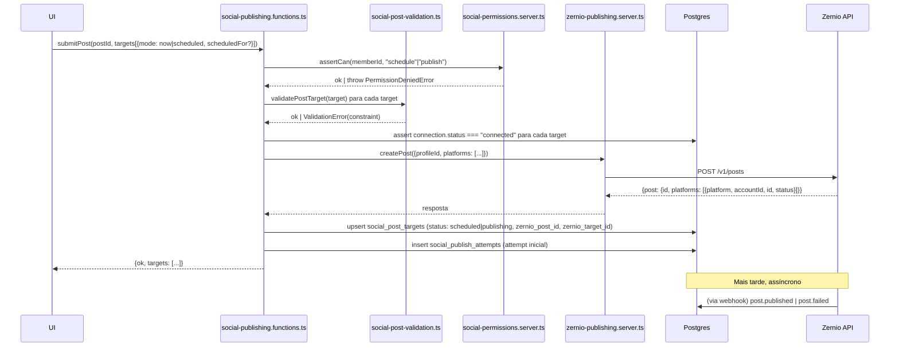

# Design Document: Social Media Publishing

## Overview

O Social_Publishing_Module é um módulo novo e estruturalmente isolado do ZapFlow, que permite aos Workspace_Members compor, agendar e publicar Posts em Facebook, Instagram, TikTok e YouTube. Ele usa a mesma plataforma Zernio (https://zernio.com/api/v1) já integrada para mensageria, mas através de um conjunto de endpoints completamente diferente (`/v1/posts`, `/v1/media/presign`, `/v1/connect/{platform}` com platform de rede social), com seu próprio client HTTP dedicado, suas próprias tabelas, seu próprio bucket de mídia e sua própria navegação.

**Decisão-chave: scheduling nativo da Zernio + webhook como fonte de verdade de status.**

A Zernio já aceita `scheduledFor` + `timezone`, `publishNow: true`, ou nenhum dos dois (rascunho) na criação de um post. Duas abordagens foram avaliadas:

| Abordagem | Vantagens | Desvantagens |
|---|---|---|
| **A. Scheduler local** (worker próprio dispara `publishNow` no horário exato) | Controle total do timing; não depende de webhook para saber "quando" disparar | Reinventa um scheduler (mais um worker, mais uma tabela de jobs, mais um ponto de falha); exige polling ou cron; se o worker cair, posts atrasam |
| **B. Scheduling nativo da Zernio + webhook de status** (escolhida) | Zernio já resolve o "quando" com confiabilidade da própria plataforma; nosso código só reage a eventos (`post.published`, `post.failed`); menos infraestrutura própria | Ficamos dependentes da entrega do webhook para saber o resultado; precisamos de uma consulta de reconciliação (polling leve) como rede de segurança para webhooks perdidos |

Optamos pela **Abordagem B**: ao agendar, enviamos `scheduledFor`/`timezone` para a Zernio na criação do Post_Target; a Zernio dispara a publicação no horário e notifica via webhook. Isso satisfaz Requirement 5.3 sem exigir um scheduler próprio. Como rede de segurança (webhooks podem ser perdidos), um mecanismo leve de reconciliação consulta `GET /v1/posts/{id}` para qualquer Post_Target que permaneça em `scheduled`/`publishing` muito tempo após seu `scheduled_for` — isso é implementado como parte do processo de verificação periódica descrito em Error Handling, **sem** usar a tabela `message_jobs` nem o `job-worker.ts` existente (isolamento).

**Decisão-chave: mídia re-hospedada no Supabase Storage próprio.**

A Zernio oferece presigned upload (`POST /v1/media/presign` → PUT → `publicUrl`), mas essa URL tem retenção temporária (~7 dias) no storage da Zernio. Para manter controle total sobre a mídia dos clientes (edição posterior, re-uso em novos posts, auditoria), o módulo re-hospeda toda mídia enviada no bucket dedicado `social-media` do nosso Supabase Storage e passa a URL pública do Supabase diretamente para a Zernio no campo `mediaUrl` do post (a documentação da Zernio confirma que URLs do Supabase Storage são aceitas — o proxy de mídia da Zernio já lida com esse padrão, usado hoje para o download inverso em `downloadZernioMedia`). Isso elimina a necessidade de gerenciar o presign da Zernio no caminho principal de publicação.

## Architecture

```mermaid
graph TB
    subgraph Client["Browser (React)"]
        UI[Composer / Calendário / Contas / Permissões]
    end

    subgraph Server["TanStack Start Server Functions"]
        SF[social-publishing.functions.ts]
        VAL[social-post-validation.ts<br/>limites por rede/Post_Type]
        PERM[social-permissions.server.ts]
    end

    subgraph ServerOnly["Server-only libs"]
        ZC[zernio-publishing.server.ts<br/>client dedicado]
        RECON[social-reconciliation.server.ts<br/>verificação periódica]
    end

    subgraph DB["Supabase Postgres (tabelas novas)"]
        SAC[social_account_connections]
        SP[social_posts]
        SPT[social_post_targets]
        SPA[social_publish_attempts]
        SPP[social_publishing_permissions]
    end

    subgraph Storage["Supabase Storage"]
        BUCKET[bucket: social-media]
    end

    subgraph External["Zernio API (endpoints de posts)"]
        EP1[GET /v1/connect/:platform]
        EP2[POST /v1/posts]
        EP3[GET /v1/posts/:id]
        EP4[POST /v1/posts/:id/retry]
    end

    subgraph Webhook["Webhook dedicado"]
        WH[api/public/zernio-social.ts]
    end

    UI -->|server fn calls| SF
    SF --> VAL
    SF --> PERM
    SF --> ZC
    SF <--> DB
    UI -->|upload direto| BUCKET
    ZC --> EP1
    ZC --> EP2
    ZC --> EP3
    ZC --> EP4
    External -->|post.published / post.failed / account.connected / account.disconnected| WH
    WH --> DB
    RECON --> ZC
    RECON --> DB

    style DB fill:#1a3a1a
    style ServerOnly fill:#1a1a3a
    style Webhook fill:#3a1a1a
```



### Isolamento de código (mapeamento de arquivos novos)

| Camada | Arquivo (novo) | Observação |
|---|---|---|
| Client HTTP Zernio dedicado | `src/lib/zernio-publishing.server.ts` | Reusa o padrão `call()` com Bearer token, mas é um módulo próprio; nunca importa nem é importado por `zernio.server.ts` |
| Server functions | `src/lib/social-publishing.functions.ts` | Composição, agendamento, publicação, retry |
| Validação por rede/Post_Type | `src/lib/social-post-validation.ts` | Função pura, tabela de limites hardcoded (sem I/O) |
| Permissões | `src/lib/social-permissions.server.ts` | Resolução e enforcement de Publishing_Permission |
| Reconciliação | `src/lib/social-reconciliation.server.ts` | Verificação periódica de posts presos em scheduled/publishing |
| Webhook | `src/routes/api/public/zernio-social.ts` | Endpoint dedicado, eventos `post.*` e `account.*` |
| Mapeamento de linhas | `src/features/social-publishing/*-row.ts` | Um módulo por entidade (convenção do projeto, já que não há tipos gerados do Supabase) |
| UI | `src/features/social-publishing/**` | Componentes de composição, calendário, contas, permissões |
| Rotas | `src/routes/_authenticated.social.*.tsx` | Navegação própria, fora de `/inbox` |

### Nota de alinhamento com o Design System

Todos os componentes de UI deste módulo devem seguir os tokens e padrões visuais existentes no ZapFlow:

- **Botões de ação**: `--radius-pill` (999px, pill arredondado), classes `btn-primary` para CTAs primárias ou `buttonPrimary`/`buttonSecondary` (de `settings-layout.tsx`) para telas de configuração.
- **Cards e painéis**: componente `Card` de `@/components/ui/card` com `--radius-card`.
- **Inputs e selects**: `--radius-control` (10px).
- **Toasts de feedback**: `toast` de `sonner` (padrão de todo o projeto).
- **Empty states**: componente `EmptyState` de `@/components/empty-state`.
- **Badges de status**: componente `Badge` de `@/components/ui/badge` com variantes `success`/`warning`/`danger`/`neutral`.
- **Ícone Lucide na sidebar**: `Share2` (ou `Megaphone` se preferir destaque visual). Valor `agentVisible: true` (visível para agentes que tenham permissão `create_edit_draft`).

## Components and Interfaces

### 1. Cliente Zernio de Publicação (`zernio-publishing.server.ts`)

Reusa o helper `call()` (mesmo padrão de `zernio.server.ts`: `Authorization: Bearer ${ZERNIO_API_KEY}`, base `https://zernio.com/api/v1`), mas em arquivo dedicado para não acoplar aos tipos/funções de mensageria.

```typescript
export type SocialPlatform = "facebook" | "instagram" | "tiktok" | "youtube";

export type ZernioPostTargetInput = {
  platform: SocialPlatform;
  accountId: string;
  postType: string;             // ex: "feed" | "reel" | "story" | "carousel" | "video" | "short" | "photo_carousel"
  text?: string;
  mediaUrls?: string[];
  scheduledFor?: string;        // ISO 8601; ausente + publishNow=false => draft
  timezone?: string;            // IANA, obrigatório se scheduledFor presente
  publishNow?: boolean;
};

export const zernioPublishing = {
  getConnectUrl: (platform: SocialPlatform, profileId: string, redirectUrl: string) =>
    call<{ authUrl: string; state: string }>(`/connect/${platform}`, {
      method: "GET",
      query: { profileId, redirect_url: redirectUrl },
    }),

  listAccounts: (profileId: string, platform?: SocialPlatform) =>
    call<any>("/accounts", { method: "GET", query: { profileId, platform } }),

  presignMedia: (body: { filename: string; contentType: string }) =>
    call<{ uploadUrl: string; publicUrl: string; expiresAt: string }>("/media/presign", {
      method: "POST",
      json: body,
    }),

  createPost: (body: { profileId: string; platforms: ZernioPostTargetInput[] }) =>
    call<{ post: { id: string; platforms: Array<{ platform: string; accountId: string; status: string; id: string }> } }>(
      "/posts",
      { method: "POST", json: body },
    ),

  getPost: (postId: string) => call<any>(`/posts/${encodeURIComponent(postId)}`),

  retryPostTarget: (postId: string, platform: SocialPlatform, accountId: string) =>
    call<any>(`/posts/${encodeURIComponent(postId)}/retry`, {
      method: "POST",
      json: { platform, accountId },
    }),
};

export async function ensureSocialProfile(workspaceLabel: string): Promise<string> { /* ... */ }
```

`ensureSocialProfile` espelha `ensureZernioProfile`, mas usa um prefixo distinto (`zapflow-social:<label>`) para nunca colidir com o profile de mensageria (`zapflow:<label>`) — mesmo workspace, dois profiles Zernio diferentes.

### 2. Modelo de dados (linhas mapeadas em módulos dedicados)

Cada tabela tem seu módulo `*-row.ts` em `src/features/social-publishing/`, seguindo a convenção do projeto (sem tipos gerados do Supabase, tudo `any` nas queries; o mapeamento tipado vive num lugar só).

### 3. Fluxo de composição (`ComposerPanel`)

Um Post agrega N Post_Targets. A UI permite:
- Editar texto/mídia "base" que é copiado para cada novo Post_Target (ponto de partida), mas cada Post_Target mantém sua própria cópia editável (Requirement 4.3 — independência total após a cópia inicial).
- Selecionar Post_Type por Post_Target a partir do conjunto suportado pela Social_Network daquele target (`getSupportedPostTypes(platform)` em `social-post-validation.ts`).
- Ver preview e violações de limite em tempo real via `validatePostTarget()`.

### 4. Fluxo de agendamento/publicação



### 5. Webhook dedicado (`api/public/zernio-social.ts`)

Estrutura análoga a `api/public/zernio.ts` (verificação HMAC com `X-Zernio-Signature`, mas usando um secret **próprio**, `ZERNIO_SOCIAL_WEBHOOK_SECRET`, para permitir rotação independente), tratando os eventos:

- `account.connected` → cria/atualiza `social_account_connections` (status `connected`).
- `account.disconnected` / `account.token_expired` → atualiza status para `disconnected`/`expired`.
- `post.published` → localiza o Post_Target por `zernio_post_id` + `zernio_target_id`, seta `status=published`, grava `platform_post_id` e `published_at`.
- `post.failed` → localiza o Post_Target, seta `status=failed`, grava `error_message`, insere/atualiza o `social_publish_attempts` correspondente.

O handler resolve `owner_user_id` via `social_account_connections.account_id`, do mesmo jeito que o webhook de mensageria resolve via `zernio_accounts.account_id` — mas consultando a tabela nova e isolada.

### 6. Reconciliação (rede de segurança, não é um scheduler)

`social-reconciliation.server.ts` expõe uma função `reconcileStalePostTargets()` que:
1. Busca `social_post_targets` com `status in ('scheduled','publishing')` e `scheduled_for < now() - 5 minutos` (ou sem `scheduled_for` e `status='publishing'` há mais de 5 minutos).
2. Para cada um, chama `zernioPublishing.getPost(zernio_post_id)` e aplica o status retornado (mesma lógica de aplicação usada pelo webhook, extraída para uma função compartilhada `applyZernioPostResult()`).

Esta função é acionada por uma rota autenticada apenas por um secret de cron (`api/public/social-reconcile.ts`, chamada por um cron do Vercel ou por invocação manual), **não** pelo `job-worker.ts`/`message_jobs` existente — mantendo isolamento total do worker de mensageria. Diferente de um scheduler completo, ela não decide "quando publicar": só corrige o status quando o webhook falhar em chegar.

### 7. Permissões (`social-permissions.server.ts`)

```typescript
type SocialAction = "create_edit_draft" | "connect_account" | "schedule" | "publish_now";

async function resolvePermissions(workspaceOwnerId: string, memberUserId: string): Promise<Record<SocialAction, boolean>> {
  // 1. Busca override específico do membro em social_publishing_permissions (scope='member').
  // 2. Se não houver, busca override do papel (scope='role').
  // 3. Se não houver, aplica o default hardcoded do papel:
  //    manager -> todas true; agent -> só create_edit_draft true, demais false.
}

async function assertCan(workspaceOwnerId: string, memberUserId: string, action: SocialAction): Promise<void> {
  const perms = await resolvePermissions(workspaceOwnerId, memberUserId);
  if (!perms[action]) throw new Error(`Ação "${action}" não permitida para este membro.`);
}
```

## Data Models

Todas as tabelas novas, sem overlap de FK com `contacts`, `messages`, `zernio_accounts`. Migrations serão criadas na fase de Tasks (não incluídas aqui).

### `social_account_connections`
| Coluna | Tipo | Notas |
|---|---|---|
| id | uuid PK | |
| owner_user_id | uuid FK auth.users | dono do workspace |
| platform | text | check in (facebook, instagram, tiktok, youtube) |
| zernio_profile_id | text | profile de publicação, distinto do de mensageria |
| account_id | text | id da conta na Zernio |
| account_name | text | nome de exibição/username |
| status | text | connecting \| connected \| expired \| disconnected |
| connected_at | timestamptz | |
| created_at / updated_at | timestamptz | |

Índice único `(owner_user_id, platform, account_id)`.

### `social_posts`
| Coluna | Tipo | Notas |
|---|---|---|
| id | uuid PK | |
| owner_user_id | uuid FK auth.users | |
| created_by | uuid FK auth.users | Workspace_Member autor |
| base_text | text | texto de partida (não é o publicado — cada target tem o seu) |
| status | text | draft \| scheduled \| publishing \| published \| failed \| partially_published (derivado, ver Error Handling) |
| created_at / updated_at | timestamptz | |

### `social_post_targets`
| Coluna | Tipo | Notas |
|---|---|---|
| id | uuid PK | |
| post_id | uuid FK social_posts | |
| owner_user_id | uuid FK auth.users | denormalizado para RLS direta |
| social_account_connection_id | uuid FK social_account_connections | |
| platform | text | denormalizado (facebook/instagram/tiktok/youtube) |
| post_type | text | feed/story/reel/carousel/video/short/photo_carousel etc. |
| text | text | texto específico deste target |
| media_urls | jsonb (array de string) | URLs do bucket `social-media` |
| status | text | draft \| scheduled \| publishing \| published \| failed |
| scheduled_for | timestamptz nullable | |
| timezone | text nullable | IANA |
| zernio_post_id | text nullable | id do post na Zernio |
| zernio_target_id | text nullable | id da entrada `platforms[]` na Zernio |
| platform_post_id | text nullable | id do post resultante na rede |
| published_at | timestamptz nullable | |
| error_message | text nullable | |
| created_at / updated_at | timestamptz | |

### `social_publish_attempts`
| Coluna | Tipo | Notas |
|---|---|---|
| id | uuid PK | |
| post_target_id | uuid FK social_post_targets | |
| owner_user_id | uuid FK auth.users | |
| attempt_number | int | sequencial por post_target |
| result | text | success \| failure |
| error_message | text nullable | |
| started_at / finished_at | timestamptz | |

Append-only: nunca é feito `UPDATE`/`DELETE` num Publish_Attempt já gravado (Requirement 6.5).

### `social_publishing_permissions`
| Coluna | Tipo | Notas |
|---|---|---|
| id | uuid PK | |
| owner_user_id | uuid FK auth.users | |
| scope | text | member \| role |
| member_user_id | uuid nullable FK auth.users | preenchido quando scope=member |
| role | text nullable | manager \| agent, preenchido quando scope=role |
| create_edit_draft | boolean | |
| connect_account | boolean | |
| schedule | boolean | |
| publish_now | boolean | |
| updated_at | timestamptz | |

Índice único `(owner_user_id, scope, member_user_id)` e `(owner_user_id, scope, role)` (parciais). Ausência de linha = usa o default hardcoded do papel.

### Storage

Bucket dedicado `social-media` (novo), separado de `chat-media`. Caminho: `${ownerUserId}/${postTargetId ?? "draft"}-${timestamp}-${uuid}.${ext}`.

## Isolamento do Módulo de Mensageria

Esta seção documenta explicitamente o que o Social_Publishing_Module **nunca** compartilha com o módulo de mensageria existente, respondendo diretamente ao Requirement 1:

1. **Tabelas**: `social_account_connections`, `social_posts`, `social_post_targets`, `social_publish_attempts`, `social_publishing_permissions` são todas novas. Nenhuma delas tem FK para `contacts`, `messages`, `zernio_accounts`, `message_jobs`, `csat_surveys` ou qualquer outra tabela de mensageria. `owner_user_id` referencia apenas `auth.users`, nunca uma entidade de mensageria.
2. **Credenciais/OAuth**: `social_account_connections.zernio_profile_id` é sempre criado por `ensureSocialProfile()` (prefixo `zapflow-social:`), nunca reaproveitando o `zernio_profile_id` de `zernio_accounts` (prefixo `zapflow:`) — mesmo quando a página do Facebook conectada é literalmente a mesma conta usada para mensageria, a Zernio trata como duas conexões (`accountId`) distintas dentro de dois profiles distintos.
3. **Client HTTP**: `zernio-publishing.server.ts` é um arquivo novo, que não importa nem é importado por `zernio.server.ts`. Os dois usam o mesmo padrão de `call()` (Bearer token, base URL), mas são implementações independentes — uma mudança em um não força mudança no outro.
4. **Endpoints da Zernio usados**: mensageria usa `/inbox/*`, `/whatsapp/*`, `/connect/whatsapp`, `/connect/instagram`. Publicação usa `/posts`, `/media/presign`, `/connect/facebook|instagram|tiktok|youtube`. Mesmo quando a plataforma é "instagram" nos dois módulos, os fluxos de connect são operações distintas na Zernio (uma cria uma conexão de inbox, outra uma conexão de publicação) e resultam em `accountId`s e registros locais diferentes.
5. **Webhook**: `api/public/zernio-social.ts` é um endpoint dedicado com seu próprio secret HMAC (`ZERNIO_SOCIAL_WEBHOOK_SECRET`), tratando exclusivamente eventos `post.*` e `account.*` de publicação. O webhook de mensageria (`api/public/zernio.ts`) continua tratando apenas `message.*`/`reaction.*`. Nenhum dos dois lê o payload do outro.
6. **Storage**: bucket `social-media`, nunca `chat-media`.
7. **Navegação**: entry point de topo próprio na sidebar (`Publicações` ou similar), com rotas `_authenticated.social.*.tsx`, sem qualquer link cruzado obrigatório com `/inbox`.
8. **Fila assíncrona**: o módulo não insere jobs em `message_jobs` e não é processado por `job-worker.ts`/`npm run worker`. A verificação periódica de reconciliação (seção Components) roda como rota HTTP própria (chamada por cron externo), com sua própria tabela de leitura (`social_post_targets`), nunca tocando `message_jobs`.
9. **Papéis reaproveitados, permissões próprias**: o módulo lê o papel existente (`manager`/`agent`, via `get_my_role()`/`useRole()`) apenas como **entrada** para resolver o default de `Publishing_Permission`, mas todo o estado de permissão fica em `social_publishing_permissions`, tabela nova — não há escrita nem leitura de tabelas de permissão de mensageria.

## Correctness Properties

*A property is a characteristic or behavior that should hold true across all valid executions of a system—essentially, a formal statement about what the system should do. Properties serve as the bridge between human-readable specifications and machine-verifiable correctness guarantees.*

### Property 1: Gate por status de conexão

For any Social_Account_Connection and any attempt to select it as the target of a new Post_Target or to start a new Publish_Attempt, the attempt SHALL be allowed if and only if the connection's status is `connected`; for any other status (`connecting`, `expired`, `disconnected`), the attempt SHALL be rejected with a descriptive error.

**Validates: Requirements 2.4, 3.2**

### Property 2: Preservação de histórico após desconexão

For any Workspace with a set of previously published Post_Targets that used a given Social_Account_Connection, disconnecting that connection SHALL NOT delete or modify any existing Post, Post_Target, or Publish_Attempt record that references it; querying the publication history after disconnection SHALL return the same records as before.

**Validates: Requirements 3.3**

### Property 3: Independência de campos entre Post_Targets do mesmo Post

For any Post with two or more Post_Targets, and for any field (text, media_urls, post_type, or the immediate/scheduled choice) modified on one Post_Target, the values of that same field on every other Post_Target of the same Post SHALL remain unchanged.

**Validates: Requirements 4.3, 5.1**

### Property 4: Exigência de Post_Type válido antes de agendar/publicar

For any Post_Target, attempting to schedule or publish it SHALL succeed only if its `post_type` is set and belongs to the set of Post_Types supported by its Social_Network; for any unset or unsupported `post_type`, the attempt SHALL be rejected with a descriptive error, regardless of the rest of the Post_Target's content.

**Validates: Requirements 4.4**

### Property 5: Validação de Scheduled_Time estritamente futuro

For any candidate `Scheduled_Time` T and the current time N at the moment of the request, THE Social_Publishing_Module SHALL accept T as a schedule if and only if T is strictly later than N; for any T that is equal to or earlier than N, the request SHALL be rejected with a descriptive error.

**Validates: Requirements 5.2**

### Property 6: Ausência de limite artificial de agendamentos concorrentes

For any Workspace and any number N of Posts/Post_Targets with valid, non-conflicting Scheduled_Time values submitted for scheduling, none of them SHALL be rejected solely because of the count N of concurrently scheduled Posts in that Workspace.

**Validates: Requirements 5.4**

### Property 7: Independência e validade de status entre Post_Targets do mesmo Post

For any Post with two or more Post_Targets, and for any sequence of Publish_Attempt results (success or failure) applied independently to each Post_Target, each Post_Target's resulting `Post_Status` SHALL always be one of `draft`, `scheduled`, `publishing`, `published`, or `failed`, and SHALL depend only on the results applied to that specific Post_Target — never on the results applied to any sibling Post_Target of the same Post.

**Validates: Requirements 6.1, 6.4**

### Property 8: Registro do resultado de um Publish_Attempt

For any Post_Target and any Publish_Attempt outcome reported by the Social_Network (success with a platform post identifier and a published time, or failure with an error message), applying that outcome SHALL set the Post_Target's `Post_Status` to `published` (recording the platform post identifier and published time) when the outcome is success, or to `failed` (recording the error message) when the outcome is failure — with no other status resulting from either outcome.

**Validates: Requirements 6.2, 6.3**

### Property 9: Preservação de histórico de Publish_Attempts após retry

For any Post_Target with an existing sequence of Publish_Attempt records, retrying it SHALL create exactly one new Publish_Attempt record and SHALL leave every previously recorded Publish_Attempt unchanged and present, so that the total count of Publish_Attempt records for that Post_Target after the retry equals the count before the retry plus one.

**Validates: Requirements 6.5**

### Property 10: Validação de conteúdo contra restrições de rede/Post_Type

For any Post_Target with a given (Social_Network, Post_Type) combination and any candidate text length or media set (count, format, resolution, duration), THE Social_Publishing_Module SHALL allow scheduling or publishing if and only if the text length does not exceed that combination's character limit AND every media constraint (format, resolution, duration, count) for that combination is satisfied; for any violation, the module SHALL reject the action and identify which specific constraint (character limit, format, resolution, duration, or count) was violated.

**Validates: Requirements 7.2, 7.3**

### Property 11: Precedência na resolução de Publishing_Permission

For any Workspace_Member, resolving their Publishing_Permission set SHALL return the member-specific override when one exists for a given action; otherwise the role-specific override when one exists; otherwise the hardcoded default for their role (Manager: all four actions allowed; Agent: only create/edit draft allowed). This precedence SHALL hold immediately after any Manager update to the permission settings.

**Validates: Requirements 8.2, 8.3**

### Property 12: Enforcement de Publishing_Permission por ação

For any Workspace_Member, any Social_Publishing_Module action (create/edit draft, connect/disconnect account, schedule, publish immediately), and any resolved Publishing_Permission set, THE Social_Publishing_Module SHALL allow the action if and only if the resolved permission for that action is true; when false, the action SHALL be denied and a descriptive error SHALL be displayed.

**Validates: Requirements 8.4**

## Limites por Rede e Post_Type (tabela hardcoded de validação)

Fonte: documentação pública das APIs de cada rede (Meta Graph API / Instagram Graph API, TikTok Content Posting API, YouTube Data API v3), consultada em preparação deste design. Estes valores alimentam `social-post-validation.ts` e o preview (Requirement 7).

| Social_Network | Post_Type | Limite de caracteres | Mídia |
|---|---|---|---|
| Facebook | feed | 50.000 | 1 imagem/vídeo, ou nenhum |
| Facebook | reels | 50.000 | 1 vídeo, até 60s (reels) |
| Facebook | stories | 50.000 | 1 imagem ou vídeo, expira em 24h |
| Instagram | feed | 2.200 | 1 imagem ou vídeo |
| Instagram | carousel | 2.200 | 2 a 10 itens (imagem/vídeo) |
| Instagram | story | 2.200 | 1 imagem ou vídeo, expira em 24h |
| Instagram | reel | 2.200 | 1 vídeo |
| TikTok | video | 2.200 | 1 vídeo |
| TikTok | photo_carousel | 2.200 (título até 90 na Zernio/TikTok) | 2 a 35 imagens |
| YouTube | video | título 100 / descrição 5.000 | 1 vídeo, sem limite curto de duração |
| YouTube | short | título 100 / descrição 5.000 | 1 vídeo vertical, até 3 minutos |

Fontes consultadas: [Meta — Reels Publishing API](https://developers.facebook.com/docs/video-api/guides/reels-publishing/), [Meta — Page Stories API](https://developers.facebook.com/docs/page-stories-api/), [Instagram caption limit — growthscribe](https://growthscribe.com/instagram-caption-character-limit/), [Instagram carousel up to 20 — socialrails](https://socialrails.com/blog/instagram-carousel-posts-guide/), [TikTok carousel limits — postfa.st](https://postfa.st/api-guides/tiktok/carousels), [TikTok caption limit — recurpost](https://recurpost.com/tiktok-scheduler/tiktok-character-limits-and-hashtags/), [YouTube Shorts duration — veed.io](https://www.veed.io/learn/youtube-shorts-api). *Content was rephrased for compliance with licensing restrictions.*

Esta tabela é **hardcoded** no código (não configurável pelo usuário nesta fase) e deve ser revisada sempre que as plataformas alterarem seus limites publicamente documentados.

## Error Handling

- **Erros de validação (Requirement 7)**: `validatePostTarget()` retorna uma lista estruturada de violações (`{ constraint: "char_limit"|"format"|"resolution"|"duration"|"count", message: string }`), exibida na UI antes de habilitar os botões de agendar/publicar.
- **Erros de permissão (Requirement 8)**: `assertCan()` lança um erro tipado (`PermissionDeniedError`) capturado pela server function, retornado à UI como mensagem descritiva (ex.: "Você não tem permissão para publicar imediatamente. Peça a um Manager para liberar essa ação.").
- **Erros de OAuth (Requirement 2.3)**: o callback de conexão social (`social-callback.tsx`, análogo a `zernio-callback.tsx`) trata `error`/`error_description` na query string, exibe toast descritivo e **não** grava `social_account_connections`.
- **Falha de Publish_Attempt (Requirement 6.3)**: o webhook grava `error_message` retornado pela Zernio (que por sua vez repassa o erro da rede social, ex.: "Instagram: legenda excede 2200 caracteres" ou "TikTok: token expirado"). Se o webhook chegar antes da resposta síncrona da criação do post, a aplicação do resultado é idempotente (upsert por `zernio_target_id`).
- **Post com múltiplos targets, falha parcial**: `social_posts.status` é **derivado**, não uma máquina de estados própria — calculado como: todos `published` → `published`; algum `failed` e algum não-`failed` → `partially_published` (rótulo de exibição, não um Post_Status formal do Requirement 6.1, que se aplica só a Post_Target); todos `failed` → `failed`; caso contrário reflete o estágio dominante (`scheduled`/`publishing`/`draft`).
- **Rate limit / erro 5xx da Zernio**: `zernio-publishing.server.ts` não implementa retry automático no client (mesma filosofia do `zernio.server.ts` atual); a UI expõe o botão "Tentar novamente" (Requirement 6.5), que cria um novo Publish_Attempt explícito.
- **Reconciliação (webhook perdido)**: `reconcileStalePostTargets()` trata a ausência de atualização por mais de 5 minutos como sinal de possível webhook perdido, consultando `GET /v1/posts/{id}` e aplicando o mesmo `applyZernioPostResult()` usado pelo webhook — nunca duplicando um Publish_Attempt já registrado (idempotência por `zernio_target_id` + status atual).

## Testing Strategy

**Abordagem dual**: testes de unidade para exemplos concretos e casos de borda (fluxos de OAuth, composição de UI, tabela de limites por rede/Post_Type), e testes de propriedade para as 12 propriedades universais listadas acima.

**Biblioteca de PBT**: `fast-check` (TypeScript/JavaScript), já que o projeto é TanStack Start + React/TS. Cada propriedade é implementada como um único teste `fc.assert(fc.property(...))` com no mínimo 100 execuções (`{ numRuns: 100 }`).

**Convenção de tag**: cada teste de propriedade inclui um comentário no formato:
`// Feature: social-media-publishing, Property N: <texto da propriedade>`

**Testes de unidade** (exemplos e casos de borda), sem propriedade universal associada:
- Construção da URL/params de conexão OAuth para cada uma das 4 plataformas (Requirement 2.1).
- Callback de OAuth bem-sucedido cria `social_account_connections` com os campos corretos (Requirement 2.2).
- Callback de OAuth com erro/negação não cria registro (Requirement 2.3).
- Composição de Post: entrada de texto + múltiplos arquivos de mídia é preservada (Requirement 4.1).
- Salvar Post como draft sem Post_Target selecionado (Requirement 4.2).
- Tabela de limites por (rede, Post_Type): uma linha de teste por combinação suportada, conferindo que os valores hardcoded batem com a tabela de Data Models (Requirement 7.1).
- Isolamento estrutural: teste de integração único que inspeciona o schema (ou executa uma query) confirmando que nenhuma das tabelas novas tem FK para `contacts`, `messages`, `zernio_accounts`, `message_jobs` (Requirement 1.1, 1.3).
- Upload de mídia grava no bucket `social-media`, nunca em `chat-media` (Requirement 1.4).
- Webhook dedicado (`zernio-social.ts`) só reage a eventos `post.*`/`account.*`, ignorando (200 OK sem processar) qualquer payload de formato de mensageria.

**Testes de propriedade** (uma tarefa por propriedade, ver tasks.md):
1. Gate por status de conexão — gerar conexões com status aleatório dentre os 4 valores e verificar a permissão de uso.
2. Preservação de histórico após desconexão — gerar um histórico aleatório de Post_Targets/Publish_Attempts, desconectar, comparar snapshot antes/depois.
3. Independência de campos entre Post_Targets — gerar N Post_Targets aleatórios, mutar campos de um, comparar os demais.
4. Exigência de Post_Type válido — gerar `post_type` aleatório (válido/inválido) por rede.
5. Scheduled_Time estritamente futuro — gerar timestamps aleatórios relativos a "agora" (passado, presente, futuro).
6. Ausência de limite de agendamentos concorrentes — gerar N aleatório de posts válidos e verificar que nenhum é rejeitado por contagem.
7. Independência e validade de status entre Post_Targets — gerar N targets e sequências aleatórias de resultados de Publish_Attempt.
8. Registro do resultado de um Publish_Attempt — gerar outcomes aleatórios de sucesso/falha com dados arbitrários.
9. Preservação de histórico após retry — gerar sequência aleatória de tentativas anteriores, executar retry, comparar contagem e conteúdo.
10. Validação de conteúdo contra restrições — gerar textos/mídias aleatórios (dentro e fora dos limites) por combinação (rede, Post_Type).
11. Precedência na resolução de permissão — gerar combinações aleatórias de overrides de member/role/default.
12. Enforcement de permissão por ação — gerar combinações aleatórias de ação × permissões resolvidas.

Todos os testes de propriedade usam mocks para a chamada HTTP à Zernio (nunca fazendo chamadas reais de rede durante os testes), mantendo o custo de execução baixo mesmo em 100+ iterações.
